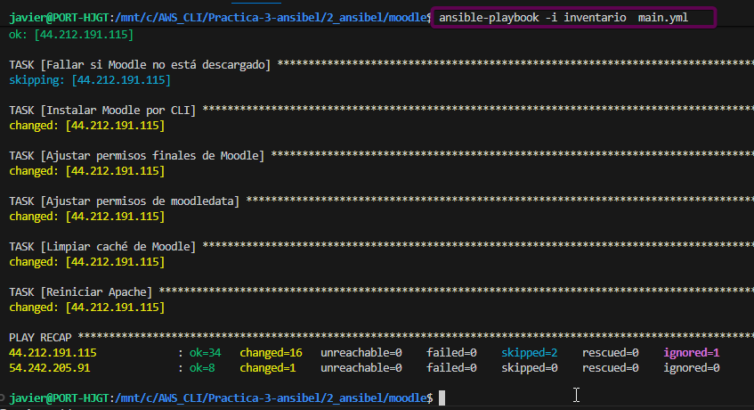
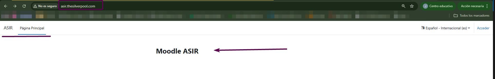

# Practica-3-2-2do-trimestre
Practica-3-2-2do-trimestre
# Va a tener 2 partes una con Terraform para automatizar la iniciacion de Las maquinas de AWS
# Primero haremos las ip elasticas:
```
resource "aws_eip" "frontend" {
  instance = aws_instance.frontend.id
}

resource "aws_eip" "backend" {
  instance = aws_instance.backend.id
}
```
# Luego pondremos instancias:
```
resource "aws_instance" "frontend" {
  ami           = var.ami_ubuntu
  instance_type = var.instance_type
  key_name      = var.key_name

  security_groups = [
    aws_security_group.frontend.name
  ]

  tags = {
    Name = "frontend"
  }
}

resource "aws_instance" "backend" {
  ami           = var.ami_ubuntu
  instance_type = var.instance_type
  key_name      = var.key_name

  security_groups = [
    aws_security_group.backend.name
  ]

  tags = {
    Name = "backend"
  }
}
```

#El output:
```
output "frontend_ip" {
  value = aws_eip.frontend.public_ip
}

output "backend_ip" {
  value = aws_eip.backend.public_ip
}
```

# El uso de el proveedor:
```
terraform {
  required_providers {
    aws = {
      source = "hashicorp/aws"
    }
  }
}

provider "aws" {
  region = "us-east-1"
}
```

#Luego los grupos de seguridad:
```
resource "aws_security_group" "frontend" {
  name        = "frontend-sg"
  description = "managed by terraform"

  ingress {
    from_port   = 22
    to_port     = 22
    protocol    = "tcp"
    cidr_blocks = ["0.0.0.0/0"]
  }

  ingress {
    from_port   = 80
    to_port     = 80
    protocol    = "tcp"
    cidr_blocks = ["0.0.0.0/0"]
  }

  egress {
    from_port   = 0
    to_port     = 0
    protocol    = "-1"
    cidr_blocks = ["0.0.0.0/0"]
  }
}

resource "aws_security_group" "backend" {
  name        = "backend-sg"
  description = "managed by terraform"

  ingress {
    from_port   = 22
    to_port     = 22
    protocol    = "tcp"
    cidr_blocks = ["0.0.0.0/0"]
  }

  ingress {
    from_port   = 3306
    to_port     = 3306
    protocol    = "tcp"
    cidr_blocks = ["0.0.0.0/0"]
  }

  egress {
    from_port   = 0
    to_port     = 0
    protocol    = "-1"
    cidr_blocks = ["0.0.0.0/0"]
  }
}
```

# Luego el siguiente script es el variables.tf:
```
variable "ami_ubuntu" {}

variable "instance_type" {}

variable "key_name" {}
```
# este es el cript de variables de terraform:
```
instance_type = "t2.medium"
key_name      = "vockey"
ami_ubuntu    = "ami-0fc5d935ebf8bc3bc"
```


# Y ahora la parte de terraform ya esta completa falta la ejecucuion de la automatizacion de moodle con Ansibel

# Para la parte de ansible necesitaremos 4 .yml para la instalacion y un .yml de main para ejecutar simultanemamente los 4 anteriores
# Con un archivo de inventario que contrendra ciertas variables de el Frontend y el Backend
# Y las variables de .yml 

#  --------- BACKEND ------------
```
---
- name: Configurar backend MySQL
  hosts: backend
  become: yes
  vars_files:
    - ../variables.yml

  tasks:

    - name: Actualizar repositorios
      apt:
        update_cache: yes

    - name: Instalar MySQL Server
      apt:
        name: mysql-server
        state: present

    - name: Instalar driver Python para MySQL (OBLIGATORIO)
      apt:
        name: python3-pymysql
        state: present

    - name: Asegurar que MySQL está iniciado
      service:
        name: mysql
        state: started
        enabled: yes

    - name: Permitir conexiones remotas
      lineinfile:
        path: /etc/mysql/mysql.conf.d/mysqld.cnf
        regexp: '^bind-address'
        line: 'bind-address = 0.0.0.0'
      notify: Reiniciar MySQL

    - name: Crear base de datos Moodle
      community.mysql.mysql_db:
        name: "{{ db_name }}"
        state: present
        login_unix_socket: /var/run/mysqld/mysqld.sock

    - name: Crear usuario Moodle
      community.mysql.mysql_user:
        name: "{{ db_user }}"
        password: "{{ db_pass }}"
        host: "%"
        priv: "{{ db_name }}.*:ALL"
        state: present
        login_unix_socket: /var/run/mysqld/mysqld.sock

  handlers:
    - name: Reiniciar MySQL
      service:
        name: mysql
        state: restarted
```

#  --------- INSTALL-LAMP-FRONTEND ------------
```
---
- name: Configurar frontend Apache + PHP para Moodle
  hosts: frontend
  become: yes
  vars_files:
    - ../variables.yml

  tasks:

    # ---------------- SISTEMA ----------------
    - name: Actualizar sistema
      apt:
        update_cache: yes
        upgrade: yes

    # ---------------- APACHE + PHP ----------------
    - name: Instalar Apache y PHP con módulos necesarios
      apt:
        name:
          - apache2
          - php
          - php-mysql
          - php-xml
          - php-gd
          - php-curl
          - php-zip
          - php-mbstring
          - php-intl
          - php-soap
          - php-opcache
          - unzip
        state: present

    - name: Asegurar que Apache está iniciado
      service:
        name: apache2
        state: started
        enabled: yes

    - name: Activar mod_rewrite
      apache2_module:
        name: rewrite
        state: present

    # ---------------- CONFIGURACIÓN PHP (CLI + Apache) ----------------
    - name: Asegurar max_input_vars = 5000 en PHP CLI
      lineinfile:
        path: /etc/php/8.1/cli/php.ini
        regexp: '^max_input_vars'
        line: 'max_input_vars = 5000'
        insertafter: EOF

    - name: Asegurar max_input_vars = 5000 en PHP Apache
      lineinfile:
        path: /etc/php/8.1/apache2/php.ini
        regexp: '^max_input_vars'
        line: 'max_input_vars = 5000'
        insertafter: EOF

    - name: Aumentar memory_limit a 256M en PHP Apache
      lineinfile:
        path: /etc/php/8.1/apache2/php.ini
        regexp: '^memory_limit'
        line: 'memory_limit = 256M'
        insertafter: EOF

    - name: Aumentar upload_max_filesize a 50M en PHP Apache
      lineinfile:
        path: /etc/php/8.1/apache2/php.ini
        regexp: '^upload_max_filesize'
        line: 'upload_max_filesize = 50M'
        insertafter: EOF

    - name: Aumentar post_max_size a 50M en PHP Apache
      lineinfile:
        path: /etc/php/8.1/apache2/php.ini
        regexp: '^post_max_size'
        line: 'post_max_size = 50M'
        insertafter: EOF

    - name: Reiniciar Apache tras cambiar php.ini
      service:
        name: apache2
        state: restarted

    # ---------------- APACHE VHOST ----------------
    - name: Configurar VirtualHost para Moodle
      copy:
        dest: /etc/apache2/sites-available/000-default.conf
        content: |
          <VirtualHost *:80>
            ServerName {{ dominio }}
            DocumentRoot {{ web_dir }}

            <Directory {{ web_dir }}>
              AllowOverride All
              Require all granted
            </Directory>

            ErrorLog ${APACHE_LOG_DIR}/error.log
            CustomLog ${APACHE_LOG_DIR}/access.log combined
          </VirtualHost>

    - name: Reiniciar Apache tras configurar VHost
      service:
        name: apache2
        state: restarted

    # ---------------- LIMPIEZA TOTAL MOODLE ----------------
    - name: Eliminar instalación previa de Moodle
      file:
        path: "{{ web_dir }}"
        state: absent

    - name: Eliminar moodledata previo
      file:
        path: "{{ moodledata_dir }}"
        state: absent

    # ---------------- DESCARGA MOODLE ----------------
    - name: Descargar Moodle
      get_url:
        url: https://download.moodle.org/download.php/direct/stable401/moodle-latest-401.tgz
        dest: /tmp/moodle.tgz
        timeout: 300

    - name: Descomprimir Moodle en /var/www/html
      unarchive:
        src: /tmp/moodle.tgz
        dest: /var/www/html/
        remote_src: yes

    # ---------------- MOODLEDATA ----------------
    - name: Crear directorio moodledata
      file:
        path: "{{ moodledata_dir }}"
        state: directory
        owner: www-data
        group: www-data
        mode: "0770"

    # ---------------- PERMISOS ----------------
    - name: Ajustar permisos de Moodle
      file:
        path: "{{ web_dir }}"
        owner: www-data
        group: www-data
        mode: "0755"
        recurse: yes
```
#  --------- CERBOT ------------
```
---
- name: Configurar HTTPS con Certbot para Moodle
  hosts: frontend
  become: yes
  vars_files:
    - ../variables.yml

  tasks:

    # ---------------- CERTBOT ----------------
    - name: Instalar Certbot y plugin Apache
      apt:
        name:
          - certbot
          - python3-certbot-apache
        state: present
        update_cache: yes

    - name: Asegurar ServerName global en Apache
      lineinfile:
        path: /etc/apache2/apache2.conf
        line: "ServerName {{ dominio }}"
        create: yes

    - name: Obtener certificado SSL con Certbot
      command: >
        certbot --apache
        --non-interactive
        --agree-tos
        -m {{ email_certbot }}
        -d {{ dominio }}
      args:
        creates: /etc/letsencrypt/live/{{ dominio }}/fullchain.pem

    - name: Reiniciar Apache tras obtener certificado
      service:
        name: apache2
        state: restarted

    # ---------------- AJUSTAR HTTPS EN MOODLE ----------------
    - name: Forzar wwwroot a https en config.php
      replace:
        path: "{{ web_dir }}/config.php"
        regexp: "http://{{ dominio }}"
        replace: "https://{{ dominio }}"
      when: ansible_facts['files'][web_dir + '/config.php'] is defined

    # ---------------- PERMISOS ----------------
    - name: Ajustar permisos finales de Moodle y moodledata
      file:
        path: "{{ item.path }}"
        owner: www-data
        group: www-data
        mode: "{{ item.mode }}"
        recurse: yes
      loop:
        - { path: "{{ web_dir }}", mode: "0755" }
        - { path: "{{ moodledata_dir }}", mode: "0770" }

    # ---------------- PURGA DE CACHÉ ----------------
    - name: Limpiar caché de Moodle
      command: php {{ web_dir }}/admin/cli/purge_caches.php
      ignore_errors: yes

    - name: Reinicio final de Apache
      service:
        name: apache2
        state: restarted
```
#  --------- DEPLOY MODDLE ------------
```
---
- name: Instalar Moodle mediante CLI
  hosts: frontend
  become: yes
  vars_files:
    - ../variables.yml

  tasks:

    # ---------------- VERIFICAR QUE MOODLE EXISTE ----------------
    - name: Verificar que el instalador CLI existe
      stat:
        path: "{{ web_dir }}/admin/cli/install.php"
      register: moodle_cli

    - name: Fallar si Moodle no está descargado
      fail:
        msg: "Moodle no está descargado. Ejecuta primero el playbook del frontend."
      when: not moodle_cli.stat.exists

    # ---------------- INSTALACIÓN CLI ----------------
    - name: Instalar Moodle por CLI
      command: >
        php {{ web_dir }}/admin/cli/install.php
        --lang=es
        --wwwroot=http://{{ dominio }}
        --dataroot={{ moodledata_dir }}
        --dbtype=mysqli
        --dbhost={{ backend_private_ip }}
        --dbname={{ db_name }}
        --dbuser={{ db_user }}
        --dbpass={{ db_pass }}
        --fullname="Moodle ASIR"
        --shortname="ASIR"
        --adminuser={{ admin_user }}
        --adminpass={{ admin_pass }}
        --agree-license
        --non-interactive
      args:
        creates: "{{ web_dir }}/config.php"

    # ---------------- PERMISOS ----------------
    - name: Ajustar permisos finales de Moodle
      file:
        path: "{{ web_dir }}"
        owner: www-data
        group: www-data
        mode: "0755"
        recurse: yes

    - name: Ajustar permisos de moodledata
      file:
        path: "{{ moodledata_dir }}"
        owner: www-data
        group: www-data
        mode: "0770"
        recurse: yes

    # ---------------- PURGA DE CACHÉ ----------------
    - name: Limpiar caché de Moodle
      command: php {{ web_dir }}/admin/cli/purge_caches.php
      ignore_errors: yes

    - name: Reiniciar Apache
      service:
        name: apache2
        state: restarted
```

# --------- INVENTARIO --------
```
[frontend]
44.212.191.115

[backend]
54.242.205.91 ansible_python_interpreter=/usr/bin/python3

[all:vars]
ansible_user=ubuntu
ansible_ssh_private_key_file=/home/javier/vockey.pem
ansible_ssh_common_args='-o StrictHostKeyChecking=accept-new'
```

# ---------VARIABLES------------
```
frontend: 172.31.24.234
backend_private_ip: 172.31.29.131

db_name: moodle_db
db_user: moodle_user
db_pass: moodle_pass

admin_user: javier
admin_pass: Admin1234

web_dir: /var/www/html/moodle
moodledata_dir: /var/moodledata

dominio: asir.thesilverpool.com
email_certbot: jsanlop1309b@g.educaand.es
``` 

# --------- MAIN ----------
```
---
- import_playbook: playbooks/backend.yml
- import_playbook: playbooks/install-lamp-frontend.yml
- import_playbook: playbooks/cerbot.yml
- import_playbook: playbooks/deploy-moddle.yml
``` 



