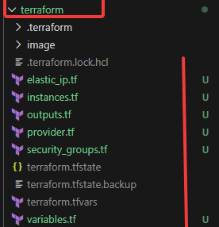
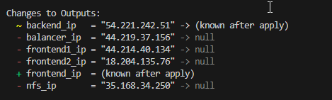
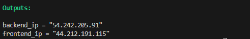

# Practica-3-2-2do-trimestre
Practica-3-2-2do-trimestre
# Va a tener 2 partes una con Terraform para automatizar la iniciacion de Las maquinas de AWS
# Primero haremos las ip elasticas:
```
resource "aws_eip" "frontend" {
  instance = aws_instance.frontend.id
}

resource "aws_eip" "backend" {
  instance = aws_instance.backend.id
}
```
# Luego pondremos instancias:
```
resource "aws_instance" "frontend" {
  ami           = var.ami_ubuntu
  instance_type = var.instance_type
  key_name      = var.key_name

  security_groups = [
    aws_security_group.frontend.name
  ]

  tags = {
    Name = "frontend"
  }
}

resource "aws_instance" "backend" {
  ami           = var.ami_ubuntu
  instance_type = var.instance_type
  key_name      = var.key_name

  security_groups = [
    aws_security_group.backend.name
  ]

  tags = {
    Name = "backend"
  }
}
```

#El output:
```
output "frontend_ip" {
  value = aws_eip.frontend.public_ip
}

output "backend_ip" {
  value = aws_eip.backend.public_ip
}
```

# El uso de el proveedor:
```
terraform {
  required_providers {
    aws = {
      source = "hashicorp/aws"
    }
  }
}

provider "aws" {
  region = "us-east-1"
}
```

#Luego los grupos de seguridad:
```
resource "aws_security_group" "frontend" {
  name        = "frontend-sg"
  description = "managed by terraform"

  ingress {
    from_port   = 22
    to_port     = 22
    protocol    = "tcp"
    cidr_blocks = ["0.0.0.0/0"]
  }

  ingress {
    from_port   = 80
    to_port     = 80
    protocol    = "tcp"
    cidr_blocks = ["0.0.0.0/0"]
  }

  egress {
    from_port   = 0
    to_port     = 0
    protocol    = "-1"
    cidr_blocks = ["0.0.0.0/0"]
  }
}

resource "aws_security_group" "backend" {
  name        = "backend-sg"
  description = "managed by terraform"

  ingress {
    from_port   = 22
    to_port     = 22
    protocol    = "tcp"
    cidr_blocks = ["0.0.0.0/0"]
  }

  ingress {
    from_port   = 3306
    to_port     = 3306
    protocol    = "tcp"
    cidr_blocks = ["0.0.0.0/0"]
  }

  egress {
    from_port   = 0
    to_port     = 0
    protocol    = "-1"
    cidr_blocks = ["0.0.0.0/0"]
  }
}
```

# Luego el siguiente script es el variables.tf:
```
variable "ami_ubuntu" {}

variable "instance_type" {}

variable "key_name" {}
```
# este es el cript de variables de terraform:
```
instance_type = "t2.medium"
key_name      = "vockey"
ami_ubuntu    = "ami-0fc5d935ebf8bc3bc"
```







# Y ahora la parte de terraform ya esta completa falta la ejecucuion de la automatizacion de moodle con Ansibel

